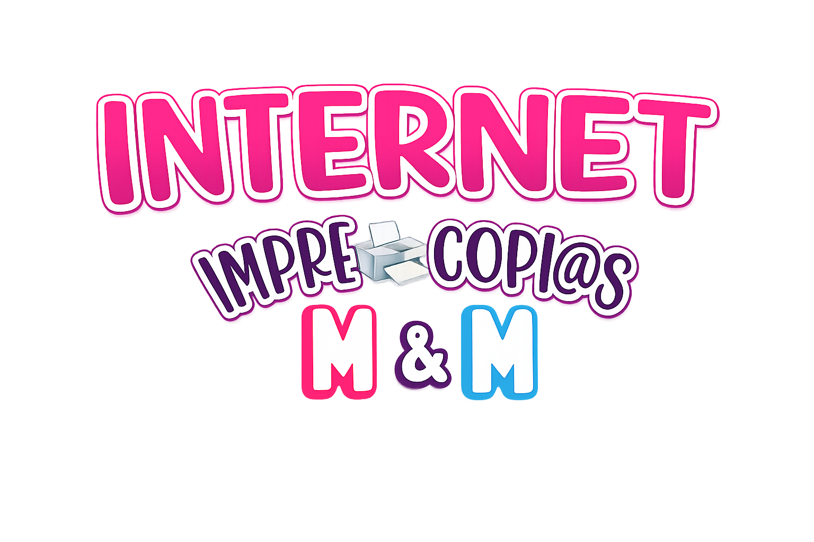
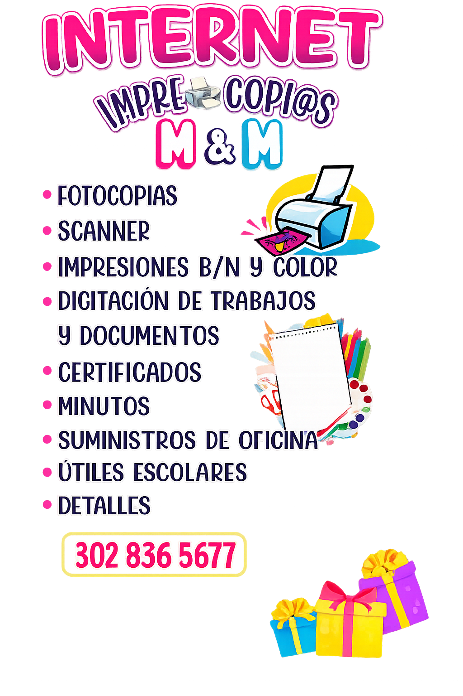

<div align="center">
  
</div>

# Papelería M&M ✏️📒

Bienvenido al código fuente de la Landing Page de **Papelería M&M**, el emprendimiento de mi mami. Un espacio diseñado para mostrar nuestros productos y conectar mejor con el barrio.

---

## Nuestros Servicios

Aquí puedes ver todo lo que ofrecemos a nuestra comunidad. Desde digitalizaciones rápidas hasta útiles escolares:

<div align="center">
  
</div>

---

## ✨ Características

- **Landing page de una sola página** con navegación por scroll-snap: cada 
  sección (Inicio, Nosotros, Servicios, Contacto) ocupa la pantalla completa y se 
  encadena de forma fluida al hacer scroll o al usar el menú de navegación.
- **Animaciones cuidadas** con Framer Motion, React Spring y GSAP: aparición 
  progresiva de textos y tarjetas, efectos hover, y un footer que se revela con 
  fade al llegar al final del recorrido.
- **Carrusel de servicios** con desplazamiento automático infinito, mostrando 
  las 6 líneas de servicio de la papelería.
- **Sección de contacto** enfocada en WhatsApp como canal principal, con horario 
  de atención y sin exponer la ubicación física del negocio.
- **Diseño responsive** adaptado a mobile, con menú de navegación tipo drawer y 
  espaciado ajustado por breakpoint.
- **Identidad visual propia**: paleta rosa fucsia y cian, tipografía redondeada, 
  y fondo de cuadrícula animado que refuerza la idea de "papelería/cuaderno".

---

## 🚀 Tecnologías Utilizadas

Este proyecto está construido con:

<div align="left">
  
  
  
  
</div>

### ¿Por qué Vite + React puro?
Se decidió utilizar **React y Vite** (en lugar de frameworks más pesados como Next.js) porque **es un proyecto pequeño** y esta combinación nos otorga la **máxima flexibilidad** y rapidez. No necesitábamos la complejidad del Server-Side Rendering para una landing page de este tipo; buscábamos un desarrollo ágil, componentes limpios y un empaquetado ultra rápido.

---

## 💻 Desarrollo Local

Si deseas correr este proyecto de manera local, los pasos son muy sencillos (asegúrate de tener `bun` instalado):

1. Clona el repositorio:
   ```bash
   git clone https://github.com/Juandamm01/PapeleriaM-M.git
   ```

2. Instala las dependencias:
   ```bash
   bun install
   ```

3. Inicia el servidor de desarrollo:
   ```bash
   bun run dev
   ```

El proyecto estará corriendo localmente en tu navegador.

## 🔧 Estado del proyecto

Actualmente el proyecto cuenta con el frontend completo y funcional, organizado 
en su carpeta `Frontend/`. El backend (para digitalizar el flujo de pedidos) está 
planeado como siguiente fase, en una carpeta separada.
